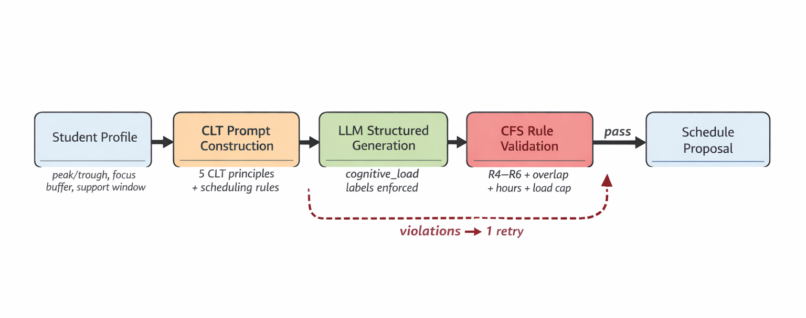
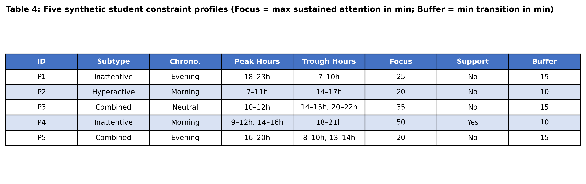

# CogniSchedule

**CLT-Grounded Constrained Prompting for ADHD-Aware Academic Scheduling**

CogniSchedule is a constraint-guided prompting framework that encodes Cognitive Load Theory (CLT) principles and ADHD-specific constraints into structured LLM prompting with deterministic post-generation validation for academic scheduling.



## Key Results

On 50 synthetic scheduling scenarios across two models (GPT-OSS-120B, Llama 3.3 70B), CogniSchedule consistently outperforms both Baseline and ADHD-Prompted conditions:

| Model | Metric | Baseline | ADHD-Prompted | CogniSchedule | Δ(C−A) | Cohen's d |
|-------|--------|----------|---------------|---------------|--------|-----------|
| GPT-OSS-120B | CFS | 0.343 | 0.546 | **0.754** | +0.411 | 1.14 |
| GPT-OSS-120B | SAP | 0.183 | 0.407 | **0.577** | +0.394 | 1.37 |
| Llama 3.3 70B | CFS | 0.505 | 0.677 | **0.715** | +0.210 | 0.72 |
| Llama 3.3 70B | SAP | 0.171 | 0.256 | **0.445** | +0.274 | 1.44 |

All comparisons significant at p < 0.001 (Wilcoxon signed-rank, Holm-Bonferroni corrected).

## Metrics

- **CFS (Cognitive Feasibility Score):** Automated constraint-feasibility proxy measuring violations of CLT-derived scheduling rules (consecutive high-load, trough placement, missing buffers, monolithic tasks).
- **SAP (Schedule Adherence Probability):** Monte Carlo estimate of P(complete ≥ 80%) incorporating timing alignment, session fit, day organization, and profile friction.

## Repository Structure

```
├── research/
│   ├── ontology/              # ADHD constraint specification (Pydantic models)
│   │   └── adhd_constraints.py
│   ├── data/                  # Synthetic scenario generation
│   │   ├── generate_scenarios.py
│   │   └── seed_schedule.py
│   ├── experiments/           # Experiment scripts
│   │   ├── run_experiments.py
│   │   ├── naturalplan_full.py
│   │   ├── robustness.py
│   │   ├── prompt_templates.py
│   │   ├── statistics.py
│   │   └── results/           # All experimental results (JSON/CSV)
│   ├── metrics/               # CFS and SAP implementations
│   │   ├── cfs.py
│   │   └── sap.py
│   └── scenarios/             # Evaluation scenario sets
├── figures/                   # Pipeline diagram + result table figures
└── LICENSE
```

## Three-Condition Design

| Condition | Description |
|-----------|-------------|
| **A) Baseline** | Generic scheduling prompt; no ADHD awareness |
| **B) ADHD-Prompted** | ADHD-oriented prompt with subtype and chronotype |
| **C) CogniSchedule** | Full CLT prompt + numeric profile constraints + explicit scheduling rules |

This progressive disclosure isolates ADHD-awareness effects (A→B) from CLT+constraint effects (B→C).

## Synthetic Student Profiles

Five profiles (P1–P5) spanning attention-pattern subtypes, chronotypes, and support-window configurations, each paired with 10 scenario types for 50 total evaluation scenarios.



## Installation

```bash
cd research
pip install -r requirements.txt
```

## Usage

```bash
# Run main experiments
python -m research.experiments.run_experiments

# Run cross-model robustness
python -m research.experiments.robustness

# Compute statistics
python -m research.experiments.statistics
```

## Citation

```bibtex
@inproceedings{cognischedule2026,
  title={CogniSchedule: CLT-Grounded Constrained Prompting for ADHD-Aware Academic Scheduling},
  author={Anonymous},
  booktitle={AIED 2026 Workshop (WideAIED)},
  year={2026}
}
```

## License

MIT License. See [LICENSE](LICENSE) for details.
